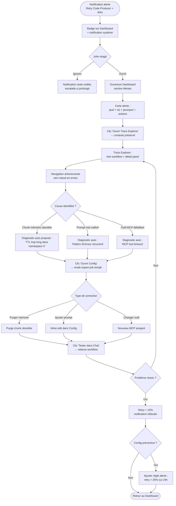
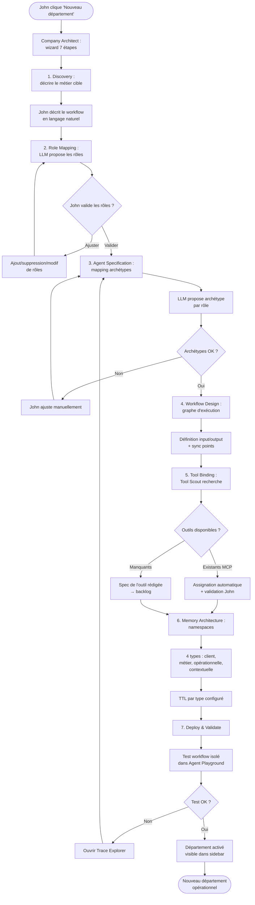

# UX Design Specification — Agentive

**Author:** John
**Date:** 2026-03-27

---

<!-- UX design content will be appended sequentially through collaborative workflow steps -->

## Executive Summary

### Vision Produit (UX)

Agentive est un cockpit de pilotage de départements IA. L'expérience utilisateur repose sur 4 espaces distincts avec une philosophie visuelle minimaliste (Linear/Notion/Trade Republic) — épurée, typographie soignée, information hiérarchisée par priorité. Le produit supporte dark et light theme.

### Utilisateurs Cibles

**John (Owner/Admin) — Utilisateur principal**
- Profil : technique, exigeant, proactif. Préfère agir plutôt que surveiller
- Usage : 40% Dashboard, 40% Chat, 15% Trace Explorer, 5% Config
- Contexte : desktop principal, mobile pour validations rapides
- Mode d'interaction : wizard guidé (défaut) + mode expert (avancé)
- Attente UX : densité d'information sans surcharge, actions en 1-2 clics maximum

**Sophie (Collaboratrice) — Utilisateur secondaire (Growth)**
- Profil : chef de projet, non technique
- Usage : Dashboard (consultation statuts), outputs (export documents)
- Contexte : desktop, lecture seule
- Attente UX : clarté immédiate, pas d'interface technique visible

**Marc (Freelance externe) — Utilisateur limité (Vision)**
- Profil : développeur, périmètre restreint à 1 projet
- Usage : Chat uniquement (interaction agents sur son périmètre)
- Contexte : desktop
- Attente UX : accès direct sans onboarding, isolation invisible mais stricte

### Défis UX Clés

1. **Dashboard et Chat à parité (40/40)** — Le Dashboard n'est pas un écran d'accueil passif. Il doit être actionnable : depuis le Dashboard, John doit pouvoir lancer une action sans navigation superflue
2. **Transition fluide entre espaces** — Le parcours Trace → Config → Chat exige une navigation contextuelle sans perte de contexte
3. **Deux modes (wizard/expert)** — L'interface Config doit supporter un mode guidé accessible et un mode expert dense, sans que l'un pollue l'autre
4. **Multi-utilisateurs avec visibilité différenciée** — L'interface s'adapte aux permissions sans paraître amputée
5. **Dark/Light theme cohérent** — Design system fonctionnel dans les deux thèmes avec contraste WCAG AA minimum

### Opportunités UX

1. **Navigation contextuelle comme différenciateur** — Le lien Trace → Config → Chat (1 clic) est un pattern UX unique dans l'orchestration IA
2. **Dashboard proactif** — La section "Recommandations" des agents transforme le Dashboard de passif en proactif. Pattern Linear : inbox d'actions prioritaires
3. **Chat comme hub central** — Point d'entrée universel : workflows, métriques, debug via conversation naturelle + raccourcis slash commands
4. **Esthétique minimaliste comme vecteur de confiance** — Le style Trade Republic/Linear inspire confiance par la clarté. Pour un système d'agents IA, l'esthétique est fonctionnelle

## Core User Experience

### Defining Experience

**Action CORE : Déléguer et valider via le Chat.** L'expérience définissante d'Agentive est le moment où John tape une instruction en langage naturel dans le Chat, les agents décomposent et exécutent la tâche, et John valide un output de qualité. 1 message → résultat. C'est le "aha moment" du produit.

**Action SUPPORT : Scanner et décider via le Dashboard.** Le Dashboard est le filet de confiance — John l'ouvre et sait en 5 secondes si tout va bien. Les métriques doivent être fiables à 100% : si le Dashboard dit "3 tâches terminées, 0 alertes", c'est vrai. Une seule métrique fausse détruit la confiance dans tout le système.

### Platform Strategy

| Aspect | Décision |
|---|---|
| **Plateforme** | Web SPA, desktop-first |
| **Input principal** | Clavier (Chat = texte, Dashboard = navigation) |
| **Mobile** | Responsive adaptatif — Chat fonctionnel, Dashboard consultation |
| **Offline** | Non requis (dépendant des LLMs) |
| **Raccourcis clavier** | Essentiels — switch entre espaces, actions rapides dans le Chat |
| **Theme** | Dark (défaut) + Light, switch instantané |

### Effortless Interactions

**1. Chat → Workflow (ZERO FRICTION)**
- John tape un message → le Dev Lead comprend, décompose, exécute
- Pas de formulaire, pas de sélection de workflow, pas de configuration préalable
- Slash commands disponibles pour les power users (`/deploy`, `/review`, `/status`)
- Autocompletion contextuelle des noms d'agents, projets, workflows récents

**2. Dashboard → Action (1 CLIC)**
- Chaque élément du Dashboard est cliquable → ouvre le contexte correspondant (Chat, Trace, Config)
- Un output en attente de validation → clic → ouvre le Chat avec l'output prêt à valider
- Une alerte → clic → ouvre le Trace Explorer sur la chaîne d'exécution concernée

**3. Trace → Config → Chat (NAVIGATION CONTEXTUELLE)**
- Depuis le Trace Explorer, un bouton "Ouvrir Config" pré-remplit le contexte de l'agent
- Depuis le Config, un bouton "Tester dans le Chat" lance un test avec les paramètres modifiés
- Le contexte (agent, workflow, projet) suit l'utilisateur entre les espaces — jamais de reset

**4. Switch d'espaces (INSTANTANÉ)**
- Sidebar fixe ou raccourcis clavier (Cmd+1 Dashboard, Cmd+2 Chat, Cmd+3 Trace, Cmd+4 Config)
- Chaque espace conserve son état — revenir au Dashboard retrouve la vue exacte quittée

### Critical Success Moments

**Moment #1 — "Ça marche" (Chat)**
John tape sa première vraie tâche dans le Chat. L'agent répond, exécute, produit un livrable de qualité. John n'a pas eu besoin d'expliquer le contexte — la mémoire et les conventions étaient déjà là.

**Moment #2 — "Je peux faire confiance" (Dashboard)**
John ouvre le Dashboard le matin. Le résumé est exact, les métriques reflètent la réalité, les alertes sont pertinentes. Aucune surprise négative. Si ce moment échoue (métrique fausse, alerte manquée), la confiance ne reviendra pas.

**Moment #3 — "Je comprends pourquoi" (Trace Explorer)**
Un output est incorrect. John ouvre le Trace Explorer, voit la chaîne complète en 3 secondes, identifie la cause, et corrige en 2 clics. Si le debug prend plus de 30 secondes, le Trace Explorer a échoué.

### Experience Principles

1. **Chat First** — Le Chat est le point d'entrée universel. Tout ce qui peut être fait via le Chat devrait pouvoir l'être
2. **Métriques = Vérité** — Le Dashboard ne ment jamais. Chaque chiffre est vérifiable, chaque alerte est actionnable. Zéro bruit, zéro faux positif
3. **Contexte Persistant** — L'utilisateur ne repart jamais de zéro. Le contexte suit l'utilisateur entre les espaces
4. **1 Clic = 1 Action** — Chaque élément actionnable mène directement à l'action. Pas de modal de confirmation pour les actions réversibles
5. **Minimaliste ≠ Vide** — L'information est dense mais hiérarchisée. Ce qui est important est visible, ce qui est secondaire est accessible en 1 clic

## Desired Emotional Response

### Primary Emotional Goals

**Émotion dominante : SOULAGEMENT.** L'émotion centrale d'Agentive est le relâchement de la charge mentale. John a délégué à des agents compétents, il peut se concentrer sur les tâches à haute valeur. "Ça tourne sans moi." C'est le sentiment qui le fait revenir chaque jour.

**Émotion secondaire : CURIOSITÉ.** Chaque matin, Agentive réveille une curiosité positive — "Qu'ont fait mes agents pendant que je dormais ?". Le Dashboard est un petit journal de nuit : découvertes, tâches accomplies, recommandations émergentes.

**Émotion de crise : CLARTÉ.** Quand ça casse, l'émotion dominante n'est pas la panique, c'est la clarté. L'alerte est visible, complète, et la cause est accessible immédiatement. "Je sais exactement ce qui ne va pas et comment le régler."

### Emotional Journey Mapping

**Matin (8h30) — CURIOSITÉ → SOULAGEMENT**
- Ouverture du Dashboard : curiosité de découvrir le résumé nocturne
- Scan rapide : soulagement de voir que tout est sous contrôle
- Validation des 2-3 outputs en attente : satisfaction discrète

**Journée (Chat) — CONFIANCE → SATISFACTION**
- Délégation d'une tâche au Chat : confiance que les agents vont délivrer
- Réception de l'output : satisfaction de la qualité
- Approbation sans re-vérification : renforcement du cycle de confiance

**Incident (Alerte) — SURPRISE → CLARTÉ → MAÎTRISE**
- Notification visible : surprise brève, pas de panique (l'alerte est précise)
- Ouverture du Trace Explorer : clarté immédiate sur la cause
- Correction : maîtrise, sentiment d'être armé face au problème

**Fin de journée — ACCOMPLISSEMENT**
- Le Dashboard montre un bilan positif : accomplissement
- John ferme Agentive sans avoir à "terminer" quoi que ce soit : sérénité

### Micro-Emotions

| Critique pour le succès | À éviter absolument |
|---|---|
| ✅ **Confiance** — John doit sentir qu'il peut faire confiance aux outputs | ❌ Skepticisme — si John doute des métriques, le produit est mort |
| ✅ **Curiosité** — Chaque retour doit susciter l'envie de voir ce qui s'est passé | ❌ Anxiété — aucune alerte ne doit créer du stress inutile |
| ✅ **Contrôle** — John reste le décideur, toujours en position de reprendre la main | ❌ Impuissance — jamais le sentiment de ne pas comprendre ce que fait le système |
| ✅ **Sérénité** — Quand tout va bien, le produit doit être silencieux et rassurant | ❌ Surcharge cognitive — trop d'information, trop de notifications, trop d'écrans |
| ✅ **Maîtrise** — En cas de problème, John doit se sentir armé pour résoudre | ❌ Frustration — un debug qui échoue ou une config qui ne comprend pas l'intention |

### Design Implications

**Soulagement → Silence par défaut**
- Aucune notification quand tout va bien. L'absence de signal est le signal
- Le Dashboard est calme par défaut (pas de couleurs vives, pas d'animations). Les alertes ressortent par contraste
- Les outputs réussis ne nécessitent pas de célébration UI

**Curiosité → Dashboard narratif**
- Le résumé Sprint Reporter raconte une histoire : "Cette nuit, le CI/CD Watcher a détecté X, l'Architect Analyst a proposé Y, le Code Producer a complété Z"
- Les "Recommandations" proactives sont présentées comme des suggestions à explorer, pas des tâches à abattre
- Métaphores temporelles : "Depuis hier", "Cette semaine", "En cours"

**Clarté → Alertes complètes, pas de crypto**
- Une alerte contient : quoi, où, pourquoi (cause probable), actions possibles (1-2 boutons)
- Pas de codes d'erreur techniques visibles — langage naturel
- Le lien vers le Trace Explorer est toujours en 1 clic depuis l'alerte
- Couleur dédiée aux alertes (rouge/orange selon sévérité) qui n'est utilisée nulle part ailleurs

**Contrôle → Actions réversibles**
- Toute action destructive (purger la mémoire, supprimer un agent) est précédée d'une confirmation
- Les actions non-destructives (relancer, modifier un prompt) sont immédiates, sans confirmation
- Un historique des actions est toujours accessible depuis l'audit trail

**Maîtrise → Information actionable**
- Le Trace Explorer propose des diagnostics ("Le chunk mémoire date de 3 semaines — probablement obsolète")
- Chaque écran de debug a au moins 1 action possible directement accessible

### Emotional Design Principles

1. **Silence = Succès** — L'absence de notification est la meilleure nouvelle. Éviter les confirmations "✓ Réussi" qui polluent l'attention
2. **Calme par défaut, signal par contraste** — L'UI est sobre en continu pour que les alertes émergent visuellement
3. **Langage humain, pas technique** — "L'agent n'a pas compris la demande" au lieu de "Parse error: invalid token"
4. **Le doute tue la confiance** — Jamais d'information ambiguë. Si le système n'est pas sûr, il le dit explicitement avec un niveau de confiance
5. **L'humain reste maître** — Chaque automatisation est accompagnée d'un mécanisme de reprise en main visible. Pas de "boîte noire qui décide à ta place"

## UX Pattern Analysis & Inspiration

### Inspiring Products Analysis

**Linear — Source principale**
- Problème résolu élégamment : gérer un flux de tickets/tâches sans friction
- Patterns forts : Cmd+K command palette, keyboard-first, auto-dismissible notifications, timeline/feed d'activité, hiérarchie par projets/équipes
- Ce qui fonctionne : silence par défaut, densité maîtrisée, micro-animations ultra-rapides, zéro bruit visuel

**Notion — Source secondaire**
- Problème résolu élégamment : organiser de l'information hiérarchique sans rigidité
- Patterns forts : slash commands, blocks modulaires, breadcrumbs, sidebar arborescente, édition inline
- Ce qui fonctionne : flexibilité de contenu, apprentissage progressif (simple au début, puissant ensuite)

**Trade Republic — Source d'esthétique**
- Problème résolu élégamment : présenter des données financières complexes de façon apaisante
- Patterns forts : typographie large, espacement généreux, couleurs sobres, charts minimalistes
- Ce qui fonctionne : lecture rapide, pas de surcharge cognitive, la donnée est belle sans être décorée

**Datadog/Grafana — Contre-référence partielle**
- Problème résolu : observabilité multi-système
- Patterns à NE PAS adopter : densité excessive, surcharge informationnelle, UI années 2010
- Patterns à adopter : drill-down fluide, corrélation entre métriques, time-series navigation

### Transferable UX Patterns

**Navigation**
- **Command Palette (Cmd+K)** — Linear/Notion. Dans Agentive : accès universel à n'importe quel workflow, agent, projet, action
- **Sidebar fixe 4 espaces** — Linear. Dans Agentive : Dashboard, Chat, Trace, Config toujours visibles, switch instantané
- **Breadcrumbs contextuels** — Notion. Dans Agentive : quand on est profond dans un Trace Explorer, retour rapide au niveau supérieur

**Interactions**
- **Slash Commands dans le Chat** — Notion. Dans Agentive : `/deploy`, `/review`, `/status`, `/traces`, autocomplétion contextuelle
- **Inline Editing** — Notion. Dans Agentive : modifier un prompt directement dans le Trace Explorer sans ouvrir la Config
- **Optimistic UI** — Linear. Dans Agentive : l'action est visuellement confirmée immédiatement, même si le workflow réel prend 10s
- **Progressive Disclosure** — Notion/Linear. Dans Agentive : le mode wizard expose l'essentiel, le mode expert dévoile les paramètres avancés

**Visuel**
- **Typography-first** — Trade Republic. Dans Agentive : la typo porte l'information, pas les icônes
- **Espacement généreux** — Trade Republic. Dans Agentive : pas de tableaux denses façon Datadog pour le Dashboard principal
- **Monochromatique + 1 couleur d'accent** — Linear. Dans Agentive : gris/blanc (dark)/noir, avec 1 couleur d'accent pour les éléments interactifs
- **Alert Red dédié** — Convention universelle. Dans Agentive : rouge exclusivement réservé aux alertes critiques

**Observabilité**
- **Time-series navigation** — Grafana. Dans Agentive : le Trace Explorer navigue dans le temps d'exécution d'un workflow
- **Drill-down progressif** — Datadog. Dans Agentive : Dashboard (vue globale) → Trace (vue workflow) → Agent (vue unitaire)

### Anti-Patterns to Avoid

| Anti-pattern | Provenance | Pourquoi éviter |
|---|---|---|
| ❌ Toasts de confirmation "Action réussie" | UI 2010 | Pollue l'attention, contradit "Silence = Succès" |
| ❌ Modals bloquantes pour actions non-destructives | Windows-like | Casse le flow, augmente la charge cognitive |
| ❌ Graphs décoratifs (jauges 3D, camemberts) | Dashboards legacy | Faible ratio info/pixel, style daté |
| ❌ Onboarding tour forcé | SaaS B2C | John est expert, veut découvrir par lui-même |
| ❌ Gamification (badges, streaks) | Duolingo-like | Contradit l'émotion "Soulagement" — pas de stress |
| ❌ Émojis dans l'UI système | Slack | Casse la sobriété Linear/Trade Republic |
| ❌ Couleurs vives multiples | Datadog legacy | Fatigue visuelle, difficulté à repérer les vraies alertes |
| ❌ Scrolls infinis | Social apps | Le Dashboard doit être "fini" visuellement |
| ❌ Animations longues | Marketing sites | Chaque ms compte pour le flow de travail |
| ❌ Dark mode inversé (light par défaut) | Apps grand public | John travaille en dark, c'est son environnement par défaut |

### Design Inspiration Strategy

**What to Adopt (directement applicable)**
- Command Palette Cmd+K (de Linear)
- Slash Commands dans le Chat (de Notion)
- Typographie-first et espacement généreux (de Trade Republic)
- Sidebar fixe 4 espaces avec raccourcis clavier (de Linear)
- Silence par défaut, notifications discrètes (de Linear)
- Monochromatique + 1 accent (de Linear)

**What to Adapt (à modifier)**
- Feed d'activité de Linear → Dashboard narratif d'Agentive (Sprint Reporter raconte, ne liste pas)
- Blocks modulaires de Notion → Cartes d'information du Dashboard (métriques, alertes, recommandations dans des blocs isolés)
- Drill-down de Datadog → Navigation contextuelle Trace → Config → Chat (1 clic, pas des tabs)
- Mode simple/expert de Notion → Wizard guidé + Mode expert d'Agentive, avec un toggle visible

**What to Avoid (ne pas reproduire)**
- La densité froide de Datadog dans le Dashboard principal (réserver au Trace Explorer uniquement)
- La gamification de produits B2C (badges, progress rings, célébrations)
- Les onboardings imposés — Agentive doit être immédiatement utilisable
- Le bruit visuel (couleurs, icônes, animations) qui casserait la promesse "Silence = Succès"

**Signature Agentive**
L'identité visuelle d'Agentive : **"Trade Republic × Linear × un soupçon de Grafana (pour le Trace uniquement)"**. Calme, typographique, keyboard-first, dense seulement où la densité est fonctionnelle.

## Design System Foundation

### Design System Choice

**Décision : shadcn/ui + Tailwind CSS + Radix Primitives**

shadcn/ui n'est pas une librairie npm traditionnelle — c'est une collection de composants basés sur Radix UI copiés directement dans le codebase. 100% ownership, pas de lock-in.

**Note :** Les versions exactes des dépendances (Tailwind, Radix, shadcn CLI, etc.) seront vérifiées par recherche web au moment de l'installation, pour garantir l'usage des dernières versions stables.

### Rationale for Selection

**1. Alignement avec les références visuelles**
Linear, Vercel, Cal.com, v0, et la majorité des outils "minimalistes modernes" utilisent shadcn/ui ou une approche similaire. Le look de base correspond directement au style cible (Trade Republic × Linear).

**2. Match avec le workflow solo + Claude Code**
- Copy-paste des composants dans le codebase → Claude Code peut les modifier directement
- Pas de dépendance npm à gérer pour l'UI → moins de surface de maintenance
- Chaque composant est lisible et éditable
- Velocity 1 epic/jour préservée : primitives prêtes, branding rapide

**3. Dark/Light theme natif**
Le système de tokens CSS variables de shadcn/ui gère dark/light automatiquement. Pas de logique custom à écrire.

**4. Accessibilité WCAG AA by default**
Radix UI (fondation de shadcn) est construit pour l'accessibilité : keyboard navigation, ARIA, focus management. NFR accessibilité satisfait sans effort additionnel.

**5. Densité flexible**
Le Dashboard (calme, espacé) et le Trace Explorer (dense) peuvent utiliser les mêmes primitives avec des paddings/tailles différentes.

**6. Command Palette native**
shadcn/ui fournit un composant `Command` (basé sur cmdk) prêt à l'emploi pour le Cmd+K — pièce centrale de l'UX Agentive.

### Implementation Approach

**Stack de base**
- Tailwind CSS (dernière version stable — vérifiée à l'installation)
- Radix UI Primitives pour les composants accessibles
- shadcn/ui comme collection initiale de composants copiés
- `lucide-react` pour les icônes (cohérent avec l'esthétique Linear)
- `cmdk` pour la Command Palette
- `framer-motion` (optionnel) pour les micro-animations

**Font**
- **Geist** (par Vercel) ou **Inter Tight** comme typo principale
- Monospace : **Geist Mono** ou **JetBrains Mono** pour code/logs dans le Trace Explorer

**Design Tokens (CSS Variables)**
```
--background, --foreground (neutrals)
--card, --card-foreground (surfaces)
--primary, --primary-foreground (accent)
--muted, --muted-foreground (texte secondaire)
--destructive, --destructive-foreground (rouge alerte)
--border, --ring (contours)
--radius (rayon de bordure)
```
Chaque token a une valeur dark et light. Switch via classe `dark` sur `<html>`.

**Palette proposée**
- **Dark (défaut)** : background `#09090B` (neutral-950), surfaces `#18181B`, accent `#8B5CF6` (violet-500) ou `#3B82F6` (blue-500) — à tester
- **Light** : background `#FFFFFF`, surfaces `#FAFAFA`, accent identique
- **Alert red** : `#EF4444` (red-500) — réservé aux alertes critiques uniquement

### Customization Strategy

**Composants à copier immédiatement depuis shadcn/ui (Sprint 0-3)**
Button, Input, Textarea, Card, Dialog, Sheet (sidebar), Command (Cmd+K), Table, Tabs, Select, Toast, Tooltip, Badge, Avatar, Separator, Accordion, Skeleton (loading states)

**Composants custom à développer (spécifiques Agentive)**
- **AgentCard** — carte d'agent avec statut, archétype, dernière activité
- **WorkflowTimeline** — visualisation temporelle d'un workflow (Trace Explorer)
- **MetricBlock** — bloc métrique Dashboard (valeur + tendance + lien d'action)
- **ChatMessage** — bulle de message avec auteur (user/agent/système)
- **TraceNode** — nœud d'un graphe d'exécution dans le Trace Explorer
- **AlertBanner** — bandeau d'alerte avec cause + actions
- **ModeToggle** — switch wizard/expert + dark/light

**Stratégie d'évolution**
- Phase MVP : 80% shadcn/ui + 20% composants custom
- Phase Growth : les composants custom deviennent un mini-design-system Agentive
- Phase Vision : extraction possible en librairie partageable

## Core User Experience — Defining Interaction

### Defining Experience

**Si on devait décrire Agentive en une phrase :** "Je tape une instruction comme à un collègue dev expérimenté, et un livrable de qualité arrive sur mon bureau."

**L'expérience définissante : la conversation productive.** Le Chat d'Agentive n'est ni un chatbot (Q&A), ni une CLI (commandes rigides), ni un formulaire (workflow pré-configuré). C'est une **conversation professionnelle avec une équipe d'agents spécialisés** qui comprennent le contexte, décomposent la tâche, exécutent et livrent.

Le moment magique : John tape "Scaffold le module paiements pour Acme, brief dans le ticket #142" → 2 secondes plus tard, le Dev Lead répond "Compris. Je mobilise Architect Analyst, Code Producer, Code Reviewer. ETA 12 min." → 12 minutes plus tard, le livrable est dans le Chat, prêt à valider.

### User Mental Model

**Modèle mental actuel (Claude Code / ChatGPT) :**
- "Je tape une demande, l'IA répond"
- Problème : pas de mémoire entre sessions, pas de spécialisation, pas de workflow
- Workaround : John répète le contexte à chaque fois

**Modèle mental cible (Agentive) :**
- "Je tape une demande à un **département**, pas à un agent"
- Le département a une **mémoire** (conventions, projets, décisions antérieures)
- Le département a une **hiérarchie** (le Dev Lead route, les agents spécialisés exécutent)
- Le département a une **qualité garantie** (Contrôleurs vérifient avant livraison)
- Analogie : manager une équipe virtuelle, pas prompter une IA

**Où John risque de se tromper :**
- Surprompter par réflexe ("Tu es un expert en X...") alors que les agents sont déjà configurés
- Hésiter à déléguer des tâches complexes au début par manque de confiance
- Chercher à contrôler chaque étape au lieu de laisser le workflow se dérouler

**Comment l'UX adresse ces risques :**
- Placeholder intelligent qui encourage la délégation simple
- Réponse immédiate du Dev Lead qui confirme la compréhension AVANT d'exécuter
- Visualisation du workflow en cours (on voit qui fait quoi)

### Success Criteria

**Ce qui fait dire "ça marche" :**
1. **Temps de réponse initial < 2s** — streaming SSE démarre immédiatement
2. **Compréhension au premier coup** — 80% des cas sans clarification nécessaire
3. **Livrable utilisable sans retouche** — output directement exploitable
4. **ETA visible et respectée** — ±20% de la promesse initiale
5. **Validation en 1 clic** — bouton "Valider", pas de formulaire

**Ce qui fait dire "wow" :**
- Un agent qui identifie proactivement un edge case oublié
- Un workflow qui termine plus vite que l'ETA annoncée
- Une recommandation d'amélioration en bonus

**Indicateurs mesurables :**
- Tâches approuvées sans re-vérification > 70%
- Temps de rédaction du message John < 30s
- Temps entre message et premier output < ETA promise

### Novel UX Patterns

**Patterns établis à réutiliser :**
- Chat à bulles (user/assistant) — standard ChatGPT/Claude/Slack
- Streaming token par token — pattern LLM standard
- Markdown rendering — standard
- Slash commands (`/deploy`, `/status`) — Slack/Discord/Notion
- Command Palette Cmd+K — Linear/VS Code

**Patterns novateurs à introduire :**
- **Multi-auteur dans le Chat** — Messages de plusieurs agents identifiés (Dev Lead, Code Reviewer, etc.) avec avatar/badge propre. Pas de confusion sur qui parle
- **Workflow inline** — Carte déroulable montrant l'état des agents en temps réel (Dev Lead ✓, Architect Analyst ⟳, Code Producer ⟳, Code Reviewer ⏸)
- **Validation inline** — Outputs dans des cartes d'action avec boutons Valider/Commenter/Voir Trace directement intégrés au flux
- **Retour de contrôleur conversationnel** — Le Code Reviewer communique comme un message de feedback structuré, pas comme une erreur technique

**Éducation utilisateur :**
- Premier usage : hint discret sur le workflow visible
- Hover sur les avatars d'agents pour comprendre les rôles
- Pas de tutoriel bloquant — découverte par l'usage

### Experience Mechanics

**1. Initiation — Accès au Chat**
- Ouverture depuis la sidebar (Cmd+2) ou action Dashboard
- Layout : historique conversations (sidebar gauche), conversation active (centre), contexte projet (header)
- Input avec placeholder contextuel : "Décris ta tâche en langage naturel..."
- Slash commands via `/`

**2. Interaction — Rédaction et envoi**
- Langage naturel OU slash command
- Autocompletion contextuelle via `@` (agents) ou `#` (projets/workflows)
- Multi-ligne (Shift+Entrée retour, Entrée envoie)
- Envoi → message user affiché, streaming Dev Lead < 200ms

**3. Exécution — Workflow visible**
- Dev Lead répond : compréhension + plan + ETA
- **Carte Workflow** déroulable avec statuts temps réel :
  - `✓ Dev Lead` — tâche décomposée (12:34)
  - `⟳ Architect Analyst` — analyse dépendances (2 min)
  - `⏸ Code Producer` — en attente
  - `⏸ Code Reviewer` — en attente
- John peut naviguer ailleurs, revenir, voir la progression
- Notification discrète à la fin (badge onglet Chat, son optionnel)

**4. Feedback — Validation**
- **Carte Output** : preview livrable + score Contrôleur + boutons
- Boutons : **Valider** / **Commenter** / **Voir Trace** / **Relancer**
- Clic Valider → carte se compacte, métriques Dashboard à jour
- Follow-up textuel interprété comme ajustement du workflow

**5. Completion — Clôture**
- Pas d'écran de félicitations
- Chat silencieux, prêt pour la prochaine demande
- Dashboard reflète les nouvelles métriques
- Historique persistant, cherchable

**Cas d'erreur gérés :**
- Incompréhension → message clarificateur précis
- Échec agent → message clair + suggestion d'action
- Dépassement ETA 50% → notification discrète
- Rejet Contrôleur → carte Output "rejeté" + feedback structuré + bouton "Relancer avec corrections"

## Visual Design Foundation

### Color System

**Philosophie : Monochromatique + 1 accent + 1 alerte.** La palette soutient le principe "Calme par défaut, signal par contraste". Maximum 3 couleurs saturées dans l'ensemble de l'interface, tout le reste est en niveaux de gris.

#### Accent — Violet

**Violet-500 (`#8B5CF6`)** comme couleur d'accent principale. Cohérent avec l'esthétique Linear/Vercel, se comporte bien en dark et light theme.

#### Palette Dark (thème par défaut)

| Token | Valeur | Usage |
|---|---|---|
| `--background` | `#09090B` (neutral-950) | Fond principal |
| `--foreground` | `#FAFAFA` (neutral-50) | Texte principal |
| `--card` | `#18181B` (neutral-900) | Surfaces élevées (cartes, blocks) |
| `--card-foreground` | `#FAFAFA` | Texte sur cartes |
| `--muted` | `#27272A` (neutral-800) | Surfaces secondaires (inputs, hover) |
| `--muted-foreground` | `#A1A1AA` (neutral-400) | Texte secondaire, metadata |
| `--border` | `#27272A` | Contours |
| `--ring` | `#8B5CF6` | Focus outline |
| `--primary` | `#8B5CF6` (violet-500) | Boutons, liens, actions |
| `--primary-foreground` | `#FAFAFA` | Texte sur boutons primaires |
| `--destructive` | `#EF4444` (red-500) | Alertes critiques uniquement |
| `--destructive-foreground` | `#FAFAFA` | Texte sur alertes |

#### Palette Light (thème secondaire)

| Token | Valeur | Usage |
|---|---|---|
| `--background` | `#FFFFFF` | Fond principal |
| `--foreground` | `#09090B` | Texte principal |
| `--card` | `#FAFAFA` (neutral-50) | Surfaces élevées |
| `--card-foreground` | `#09090B` | Texte sur cartes |
| `--muted` | `#F4F4F5` (neutral-100) | Surfaces secondaires |
| `--muted-foreground` | `#71717A` (neutral-500) | Texte secondaire |
| `--border` | `#E4E4E7` (neutral-200) | Contours |
| `--ring` | `#8B5CF6` | Focus outline |
| `--primary` | `#8B5CF6` | Boutons, liens, actions |
| `--primary-foreground` | `#FFFFFF` | Texte sur boutons primaires |
| `--destructive` | `#DC2626` (red-600) | Alertes critiques uniquement |
| `--destructive-foreground` | `#FFFFFF` | Texte sur alertes |

#### Couleurs sémantiques (usage restreint)

Pour les statuts d'exécution uniquement (workflow cards, agent states) :

| Statut | Dark | Light |
|---|---|---|
| Success (validé) | `#10B981` (emerald-500) | `#059669` (emerald-600) |
| Running (en cours) | `#8B5CF6` (violet-500) — accent principal | Idem |
| Pending (en attente) | `#71717A` (neutral-500) | Idem |
| Warning (lent/dégradé) | `#F59E0B` (amber-500) | `#D97706` (amber-600) |
| Error (échec) | `#EF4444` (red-500) | `#DC2626` (red-600) |

#### Contrastes (WCAG AA)

Tous les couples texte/fond respectent un contraste ≥ 4.5:1 pour le texte normal et ≥ 3:1 pour le texte large (18px+ ou 14px+ bold).

### Typography System

#### Font Stack

- **Primaire : Geist Sans v1.7.0** — sans-serif moderne géométrique
- **Monospace : Geist Mono v1.7.0** — code, logs, IDs, timestamps
- **Fallback système** : `-apple-system, BlinkMacSystemFont, "Segoe UI", sans-serif`

#### Type Scale

Base : 14px. Scale modulaire ratio 1.2.

| Token | Taille | Line Height | Usage |
|---|---|---|---|
| `text-xs` | 12px | 16px | Metadata, timestamps, labels discrets |
| `text-sm` | 13px | 18px | Texte secondaire, helpers |
| `text-base` | 14px | 20px | Texte courant (défaut) |
| `text-lg` | 16px | 24px | Sous-titres, emphase |
| `text-xl` | 18px | 26px | Titres de carte, section headers |
| `text-2xl` | 22px | 28px | H3 — sous-sections majeures |
| `text-3xl` | 28px | 34px | H2 — titres de vue |
| `text-4xl` | 36px | 42px | H1 — titres de page (rare) |

#### Poids

- **400 Regular** — Texte courant, paragraphes
- **500 Medium** — Emphase discrète, labels de boutons
- **600 Semibold** — Titres, headers de section
- **700 Bold** — Réservé à l'exceptionnel (alertes critiques, KPIs majeurs)

#### Règles typographiques

- **Pas d'italique en UI** (réservé aux citations dans les contenus textuels)
- **Pas de uppercase décoratif** (sauf labels très courts, ≤ 4 caractères, avec letter-spacing +2%)
- **Tabular numbers activé par défaut** pour métriques, tableaux, timestamps (feature `tnum` de Geist)
- **Line-height généreux** (1.5-1.7) pour paragraphes, compact (1.2-1.3) pour titres

### Spacing & Layout Foundation

#### Spacing Scale

Base 4px avec scale Tailwind standard :

| Token | Valeur | Usage |
|---|---|---|
| `1` | 4px | Espacement minimal (icône-texte) |
| `2` | 8px | Espacement entre éléments très rapprochés |
| `3` | 12px | Padding compact |
| `4` | 16px | Padding standard de contrôles |
| `6` | 24px | Espacement entre groupes d'éléments |
| `8` | 32px | Espacement entre sections dans une carte |
| `12` | 48px | Espacement entre cartes/blocks |
| `16` | 64px | Espacement entre sections de page |

#### Border Radius

- `--radius: 8px` (default) — cartes, boutons, inputs
- `4px` — petits éléments (badges, tags)
- `12px` — grandes surfaces (modals, dialogs)
- `9999px` — éléments circulaires (avatars)

#### Layout Grid

**Layout principal (tous espaces) :**
- **Sidebar fixe** : 240px (desktop), collapsable à 56px (icônes uniquement)
- **Main content** : fluide, max-width 1440px
- **Header** (optionnel par espace) : 56px de hauteur

**Dashboard :**
- Grid CSS responsive : 12 colonnes, gap 24px
- Cartes dimensionnées en spans (col-span-4, 6, 8, 12)
- Breakpoints : `sm: 640px`, `md: 768px`, `lg: 1024px`, `xl: 1280px`

**Chat :**
- Max-width conversation : 720px (lisibilité)
- Messages pleine largeur dans cette colonne
- Sidebar historique à gauche (280px)

**Trace Explorer :**
- Layout dense : tree view à gauche (320px), détail panel à droite (fluide)
- Pas de max-width — l'information est reine

**Config :**
- Layout formulaire : max-width 640px, centré
- Wizard mode : 1 étape visible à la fois, progression en haut
- Expert mode : accordions empilés, tous visibles

#### Principes de Layout

1. **Vertical breathing room** — Jamais d'éléments collés verticalement sauf intention spécifique (listes de métriques denses)
2. **Horizontal rhythm** — Alignement sur la grille 4px rigoureux pour éviter l'aspect "bricolé"
3. **Progressive disclosure** — Les détails avancés sont derrière un clic/hover, pas étalés par défaut

### Accessibility Considerations

#### Contraste
- **Texte normal (< 18px)** : ≥ 4.5:1 (WCAG AA)
- **Texte large (≥ 18px)** : ≥ 3:1
- **Éléments UI non-textuels** (icônes, bordures interactives) : ≥ 3:1
- Tous les tokens testés en dark ET light

#### Focus Management
- **Focus visible systématique** : ring violet-500 (`--ring`) de 2px avec offset 2px
- **Order de tabulation logique** suivant le flow visuel
- **Skip links** pour sauter la navigation (accessibilité clavier)

#### Keyboard Navigation
- **Raccourcis globaux** : Cmd+1-4 (espaces), Cmd+K (command palette), Cmd+/ (help)
- **Raccourcis contextuels** dans le Chat : Cmd+Entrée (envoyer), Cmd+Shift+L (nouveau chat)
- **Navigation Trace Explorer** : flèches pour naviguer dans le graphe, Entrée pour ouvrir un nœud

#### Screen Readers
- **ARIA labels** sur tous les boutons icon-only
- **Live regions** pour les updates asynchrones (statut workflow, nouveau message agent)
- **Structure sémantique** : `<main>`, `<nav>`, `<section>`, headers h1-h6 hiérarchiques

#### Motion & Preferences
- **`prefers-reduced-motion`** respecté : animations désactivables
- **`prefers-color-scheme`** respecté par défaut, override manuel disponible
- **Font-size minimum** : 12px (métadata), 14px (contenu principal) — respecte les tailles minimales WCAG

## Design Direction Decision

### Design Directions Explored

3 directions alternatives explorées :

**Direction 1 — "Linear Heritage" (sobriété maximale)** — Tout ressemble à Linear. Sidebar icônes-only, densité compacte, animations minimales. Pour : densité d'info, workflow power users. Contre : aspect austère.

**Direction 2 — "Trade Republic Calm" (espacement généreux)** — Tout respire. Typographie large, beaucoup de blanc, cartes avec padding généreux. Pour : émotion soulagement, lisibilité. Contre : moins d'info simultanée.

**Direction 3 — "Hybride Agentive" (densité adaptée par espace)** — Chaque espace a sa densité optimale. Dashboard/Chat respirent (Trade Republic-style), Trace Explorer est dense (Grafana-style), Config adapte selon mode.

### Chosen Direction

**Direction 3 — Hybride Agentive** (validée par John)

La densité varie selon l'espace et son usage :
- **Dashboard** : espacement généreux Trade Republic-style — 40% du temps, émotion "soulagement"
- **Chat** : max-width 720px centré, messages aérés — 40% du temps, conversation apaisante
- **Trace Explorer** : tree + détail panel, tabular numbers, monospace — 15% du temps, densité d'information
- **Config** : wizard (guidage clair) OU expert (dense, tout visible) selon toggle

### Design Rationale

1. **Alignement émotionnel parfait** — Soulagement (Dashboard/Chat aérés) + Clarté (Trace dense et factuel) + Maîtrise (Config avec deux modes)
2. **Cohérence avec les références multiples** — Linear + Trade Republic + un soupçon de Grafana, sans renier aucune inspiration
3. **Usage proportionné à la densité** — 80% du temps dans des espaces calmes, 15% dans un espace dense (quand la densité a du sens)
4. **Évite le piège "tout Grafana"** — Pas de fatigue visuelle généralisée, la densité est un outil ciblé

### Implementation Approach

**Référence visuelle :** `_bmad-output/planning-artifacts/ux-design-directions.html` (mockup interactif avec les 4 espaces, toggle dark/light, Geist, palette violet)

**Tokens CSS implémentés dans le mockup** — prêts à être extraits pour Tailwind config :
- Variables CSS dark/light via `.dark` class sur `<html>`
- Geist Sans + Geist Mono via CDN Google Fonts (pour l'implémentation réelle : npm `geist`)
- Grille 4px, radius 8px, palette violet-500 cohérente

**Patterns validés visuellement :**
- Sidebar fixe 240px avec badges département
- Top nav avec logo + tabs des 4 espaces + theme toggle
- Cmd+1-4 raccourcis clavier opérationnels
- Multi-auteur dans le Chat avec avatars d'agents colorés
- Workflow inline avec statuts temps réel (✓ done, ⟳ running, ○ pending)
- Output cards avec boutons Valider / Commenter / Voir Trace / Relancer
- Trace tree avec durées tabulaires et status dots
- Config wizard avec progression et mode toggle

**Prochaines étapes d'implémentation :**
- Sprint 0 : extraction des tokens CSS → `tailwind.config.ts`
- Sprint 0 : initialisation projet React + Tailwind + shadcn/ui (versions à vérifier à l'install)
- Sprint 1-3 : chaque composant custom (AgentCard, WorkflowTimeline, ChatMessage, etc.) est construit en référence directe au mockup HTML

## User Journey Flows

### Flow 1 — Délégation de tâche via le Chat (Journey 1)

**Entry point :** John ouvre l'app (Cmd+2 vers Chat) ou clique sur une recommandation du Dashboard.

```mermaid
flowchart TD
    Start([John ouvre Agentive]) --> Check{Action disponible<br/>sur Dashboard ?}
    Check -->|Non| OpenChat[Cmd+2 : ouvre le Chat]
    Check -->|Oui| ClickAction[Clic sur recommandation<br/>→ ouvre Chat avec contexte]
    OpenChat --> Input[Tape instruction<br/>en langage naturel]
    ClickAction --> Input
    Input --> Options{Type de formulation}
    Options -->|Prose libre| Send[Entrée : envoi message]
    Options -->|Slash command| SlashCmd[/deploy, /review, /status]
    Options -->|Mention agent| MentionAgent["@CodeProducer..."]
    SlashCmd --> Send
    MentionAgent --> Send
    Send --> DevLead[Dev Lead<br/>streaming &lt; 200ms]
    DevLead --> Understand{Comprend<br/>la demande ?}
    Understand -->|Non| Clarify[Question de clarification<br/>dans le Chat]
    Clarify --> Input
    Understand -->|Oui| Plan[Dev Lead répond :<br/>plan + ETA + agents mobilisés]
    Plan --> WorkflowCard[Carte Workflow inline<br/>avec statuts temps réel]
    WorkflowCard --> Wait[John peut naviguer ailleurs<br/>ou suivre la progression]
    Wait --> Complete{Workflow<br/>terminé ?}
    Complete -->|En cours| WorkflowCard
    Complete -->|Terminé| Output[Carte Output dans le Chat<br/>avec preview + score]
    Output --> Notify[Notification discrète<br/>badge onglet]
    Notify --> Decide{Décision John}
    Decide -->|Valider| Approve[Bouton Valider<br/>→ métrique Dashboard]
    Decide -->|Commenter| Feedback[Texte de feedback<br/>→ Dev Lead relance adapté]
    Decide -->|Debug| OpenTrace[Voir dans Trace<br/>→ contexte préservé]
    Decide -->|Relancer| Retry[Relancer avec ajustements]
    Approve --> End([Chat silencieux,<br/>prêt pour la prochaine tâche])
    Feedback --> Send
    Retry --> Send
    OpenTrace --> End
```

**Success path :** Délégation naturelle (Cmd+2 → instruction → validation en 1 clic). Temps total < 15 min pour une tâche standard.

**Moments critiques :**
- Streaming < 200ms après envoi (sinon perception de lenteur)
- Compréhension au premier coup 80% des cas (sinon clarification = friction)
- Validation en 1 clic (pas de modal, pas de formulaire)

### Flow 2 — Diagnostic depuis une alerte (Journey 2)

**Entry point :** Notification push (badge onglet Chat, son optionnel) ou alerte sur le Dashboard.



**Success path :** Alerte → Trace → Config → Chat en 4 clics max. Debug complet < 30 secondes de compréhension.

**Moments critiques :**
- Alerte claire et actionable (pas de codes techniques)
- Diagnostic automatique dans le Trace (aide, pas juste données)
- Navigation contextuelle qui préserve le contexte

### Flow 3 — Création d'un nouveau département (Journey 3, Growth)

**Entry point :** Bouton "Nouveau département" dans la sidebar ou Cmd+N depuis Config.



**Success path :** 7 étapes en 2h (selon PRD Journey 3). Chaque étape valide la précédente, pas de backtrack nécessaire en moyenne.

**Moments critiques :**
- LLM propose intelligemment (pas de formulaires vides à remplir)
- Tool Scout trouve des outils existants (sinon spec générée)
- Agent Playground disponible pour tester avant de déployer

### Journey Patterns (réutilisables)

**Pattern Navigation contextuelle**
Les 3 flows exploitent le même pattern : un élément dans un espace X → clic → bascule vers l'espace Y avec le contexte préservé. Pas de reset, pas de perte d'information.

**Pattern Proposition intelligente + validation**
Le LLM propose, John valide ou ajuste. Jamais de formulaire vide. Dev Lead propose un plan (J1), Trace Explorer propose un diagnostic (J2), Company Architect propose les rôles/archétypes/outils (J3).

**Pattern Progressive Disclosure**
L'information avancée est cachée derrière 1 clic. Workflow card se déroule (J1), Trace tree révèle les détails (J2), Wizard étape par étape vs Expert tout visible (J3).

**Pattern Feedback inline**
Pas de modals, pas de toasts. Les messages, workflows, outputs, diagnostics apparaissent dans le flux naturel.

**Pattern Silence = Succès**
Aucune confirmation de type "Action réussie". Le succès est montré par l'évolution de l'état (statut ✓, métrique Dashboard à jour, alerte clôturée).

### Flow Optimization Principles

1. **Minimiser le nombre de clics pour la happy path** — Valider un output = 1 clic. Créer un département = 7 étapes. Debug = 4 clics max.
2. **Zero empty state** — Chaque écran a du contenu ou une suggestion d'action au premier chargement.
3. **Escape hatches visibles** — Chaque flow long a un moyen de sortir (annuler workflow, fermer wizard, passer en expert).
4. **Error recovery gracieux** — Chaque erreur propose une action corrective, pas juste un message d'échec.
5. **Async-friendly** — John peut lancer une tâche et naviguer ailleurs. Les workflows longs ne bloquent jamais l'UI.

## Component Strategy

### Design System Components (shadcn/ui — Foundation)

**Composants à copier depuis shadcn/ui pour le MVP (Sprint 0-3) :**

| Composant shadcn | Usage dans Agentive |
|---|---|
| `Button` | Toutes les actions (Valider, Relancer, etc.) |
| `Input`, `Textarea` | Chat input, formulaires Config |
| `Card` | Surfaces Dashboard, conteneur des custom components |
| `Dialog` | Confirmations actions destructives uniquement |
| `Sheet` | Sidebar collapsable |
| `Command` | Command Palette Cmd+K — CRITIQUE |
| `Tabs` | Navigation entre vues secondaires |
| `Select` | Dropdowns Config (modèle LLM, archétype, etc.) |
| `Tooltip` | Hover info (rôles agents, raccourcis clavier) |
| `Badge` | Statuts (grade, archétype, département) |
| `Avatar` | Agents, utilisateurs |
| `Separator` | Séparations visuelles |
| `Skeleton` | Loading states (workflows longs, métriques) |
| `Toast` | Notifications discrètes uniquement — à utiliser avec parcimonie |
| `Accordion` | Mode expert Config, sections repliables |
| `Scroll Area` | Zones scrollables avec style cohérent |

### Custom Components

#### 1. `AgentCard`

**Purpose :** Afficher un agent de façon compacte avec identité, statut, archétype et dernière activité.
**Anatomy :** Avatar coloré selon archétype (2-char abbreviation), nom, badge archétype, status dot (success/running/pending), metadata optionnelle.
**States :** Default, Active, Hover, Disabled.
**Variants :** `compact` (sidebar), `default` (liste), `detailed` (vue détail).
**Accessibility :** `role="button"`, `aria-label` complet, keyboard Tab + Enter.

#### 2. `WorkflowCard` (inline dans le Chat)

**Purpose :** Montrer l'état d'un workflow en cours d'exécution directement dans le flux de conversation.
**Anatomy :** Header (titre, ETA), liste des steps (status icon, nom agent, durée/ETA), optionnel : bouton "Voir détail dans Trace".
**States :** `running`, `completed`, `error`, `paused`.
**Variants :** `expanded` (défaut), `collapsed`, `mini`.
**Accessibility :** `role="progressbar"`, `aria-valuenow`, live region, animation désactivable.

#### 3. `OutputCard` (inline dans le Chat)

**Purpose :** Présenter le livrable d'un workflow avec preview, score qualité et actions de validation.
**Anatomy :** Header (titre, badge score, status), preview (contenu tronqué avec fade-out), actions (Valider / Commenter / Voir Trace / Relancer).
**States :** `pending`, `validated`, `rejected`, `needs_review`.
**Variants :** `code`, `document`, `data`.

#### 4. `MetricBlock`

**Purpose :** Bloc de métrique Dashboard avec valeur, tendance et lien d'action contextuel.
**Anatomy :** Label, valeur principale (tabular-nums), tendance (vert/rouge/muted), action inline optionnelle.
**States :** `default`, `positive_trend`, `negative_trend`, `alert`.
**Variants :** `standard`, `compact`, `detailed` (avec mini-chart).

#### 5. `ChatMessage`

**Purpose :** Message dans le Chat, avec distinction claire user / agent / système.
**Anatomy :** Avatar, header (nom + timestamp), bubble avec markdown, éléments inline optionnels (WorkflowCard, OutputCard).
**States :** `sending`, `sent`, `streaming`, `complete`, `error`.
**Variants :** `user` (aligné droite), `agent` (aligné gauche, avatar coloré), `system` (centré, discret).

#### 6. `TraceNode` (Trace Explorer)

**Purpose :** Nœud d'un graphe d'exécution dans le Trace Explorer.
**Anatomy :** Indent selon profondeur, status dot, nom opération (mono), durée (mono, muted).
**States :** `success`, `running`, `pending`, `error`, `selected`.
**Accessibility :** Tree keyboard navigation (flèches), `aria-expanded`, `aria-level`.

#### 7. `AlertBanner`

**Purpose :** Bandeau d'alerte avec informations claires et actions immédiates.
**Anatomy :** Icône de sévérité, texte (quoi + où + pourquoi), actions 1-2 boutons contextuels, bouton fermeture si non-critique.
**States :** `critical`, `warning`, `info`, `resolved`.
**Variants :** `banner`, `inline`, `toast`.

#### 8. `ModeToggle`

**Purpose :** Switch entre deux modes mutuellement exclusifs (wizard/expert, dark/light).
**Anatomy :** Container avec background muted, deux options côte à côte, active = background + shadow.
**Variants :** Text-only, Icon-only, Icon + text.
**Accessibility :** `role="radiogroup"`, switch au clavier.

#### 9. `ArchetypeSelector`

**Purpose :** Sélection d'un archétype parmi les 8 disponibles.
**Anatomy :** Grid 4x2 de cartes archétypes (nom + icône), carte sélectionnée avec bordure violet.
**Variants :** `single` (primaire), `multi` (secondaires, mode expert).

#### 10. `KeyboardShortcut`

**Purpose :** Afficher un raccourci clavier de façon cohérente.
**Anatomy :** `<kbd>` wrapper, touches combinées (⌘+K), background muted, mono font.
**Accessibility :** Texte alternatif pour screen reader.

### Component Implementation Strategy

**Principe de composition :** Chaque composant custom s'appuie sur les primitives shadcn/ui plutôt que de réinventer. Exemple : `AgentCard` utilise `Card` + `Avatar` + `Badge`.

**Design tokens :** Tous les composants consomment exclusivement les tokens CSS variables définis au Step 8. Aucune couleur hard-codée.

**Variants via composition :** Préférer des sous-composants (`<AgentCard.Compact />`) plutôt qu'une prop variant.

**Accessibility by default :** Chaque composant livré avec ARIA labels, keyboard navigation, et support `prefers-reduced-motion`. Non négociable.

**Storybook / Playground :** L'Agent Playground (FR48) sert aussi de playground UI pour tester les composants custom en isolation.

### Implementation Roadmap

**Phase 1 — Core (Sprint 1-2, MVP minimum)**

| Composant | Sprint | Journey supporté |
|---|---|---|
| `ChatMessage` | 1 | J1 — Délégation |
| `WorkflowCard` | 1 | J1 — Visibilité exécution |
| `OutputCard` | 1 | J1 — Validation |
| `AgentCard` (compact) | 1 | J1 — Sidebar agents |
| `MetricBlock` | 2 | J1 — Dashboard cockpit |

**Phase 2 — Essentiels Cockpit (Sprint 3)**

| Composant | Sprint | Journey supporté |
|---|---|---|
| `TraceNode` | 3 | J2 — Diagnostic |
| `AlertBanner` | 3 | J2 — Notification |
| `ModeToggle` | 3 | Config dual-mode |
| `KeyboardShortcut` | 3 | UX power-user |

**Phase 3 — Configuration (Sprint 4-5)**

| Composant | Sprint | Journey supporté |
|---|---|---|
| `ArchetypeSelector` | 4 | J3 — Création département |
| `AgentCard` (detailed) | 4 | J3 — Liste agents |
| Wizard Stepper | 5 | J3 — Company Architect |

**Phase 4 — Enrichissement (Vision)**

- `PeerRatingHeatmap` — Innovation #14 (Vision)
- `AgentMomentumChart` — Innovation #15 (Vision)
- `DepartmentHealthIndicator` — Innovation #16 (Vision)

## UX Consistency Patterns

### Button Hierarchy

**Règle d'or :** Maximum 1 bouton primary par écran visible.

| Type | Usage | Visuel |
|---|---|---|
| **Primary** | Action principale attendue (Valider, Envoyer, Suivant, Lancer workflow) | Background violet-500, texte blanc |
| **Secondary** | Actions alternatives visibles (Commenter, Voir Trace, Annuler) | Background transparent, border muted, texte foreground |
| **Ghost** | Actions tertiaires ou dans des toolbars (Fermer, Copier, Expand) | Background transparent, pas de border, hover muted |
| **Destructive** | Actions destructives (Supprimer, Purger mémoire) | Background transparent, border destructive, texte destructive OU background destructive si action critique |
| **Icon-only** | Toolbars, actions compactes | 32x32px, icon Lucide, avec Tooltip obligatoire |

**Tailles :**
- `sm` — 28px h, 12px font — dans les cards denses
- `default` — 36px h, 14px font — usage standard
- `lg` — 44px h, 14px font — CTAs importants (Valider output)

**Règles :**
- Pas de bouton primary dans les barres de navigation
- Boutons destructifs JAMAIS primary (utilisateur ne doit pas détruire par réflexe)
- Icon + texte > Icon seul quand l'action est critique

### Feedback Patterns

**Principe fondamental : "Silence = Succès"**

| Situation | Pattern |
|---|---|
| **Action réussie (réversible)** | Silence. État change visuellement (checkmark, métrique à jour, carte compactée) |
| **Action réussie (irréversible)** | Toast discret bottom-right, 4 secondes, fermable. Ex: "Namespace purgé" |
| **Action en cours** | Bouton loading state (spinner + label inchangé), OU workflow card qui évolue |
| **Erreur récupérable** | Inline message sous le champ/action, icône warning amber, suggestion de correction |
| **Erreur critique système** | AlertBanner en haut de page ou dans la section concernée, avec action |
| **Info non-critique** | Toast muted bottom-right, 3 secondes, auto-dismiss |
| **Progression longue** | Skeleton loading OU progress bar si > 3 secondes, avec indication ETA |

**Règles :**
- **Jamais de modal "Action réussie !"** — pollue l'attention
- **Jamais de confirmation pour actions réversibles** — Cmd+Z existe
- **Toujours proposer une action** avec un message d'erreur (bouton "Réessayer", "Modifier", "Annuler")
- **Langage humain** — "Le prompt est trop long pour le modèle" > "Error: max_tokens exceeded"

### Form Patterns

**Layout :** Label au-dessus du champ (jamais placeholder comme label).

**Structure standard :**
```
<Label>               — 13px, font-medium
<Input/Select/etc>    — 14px, padding 9px 12px
<Helper text>         — 12px, muted
```

**Validation :**
- **Temps réel** pour feedback positif (✓ format email valide apparaît au blur)
- **Au submit** pour erreurs (évite l'angoisse en cours de frappe)
- Message d'erreur inline sous le champ, texte destructive, icône alerte
- Le champ en erreur a une border destructive

**Champs obligatoires :**
- Label avec `*` discret en muted
- Helper text "Obligatoire" ou "Optionnel" selon le cas
- Pas de tous-les-champs-obligatoires (demander uniquement l'essentiel)

**Inputs spéciaux :**
- **Textarea prompt système** : monospace, 120px min, resize vertical
- **Select modèle LLM** : avec icônes de provider (Anthropic, OpenAI)
- **Toggle wizard/expert** : ModeToggle custom, pas de radio classique
- **Command input** : avec `/` trigger pour slash commands, `@` pour mentions

**Règles :**
- Longueur du champ = proportionnelle à l'input attendu
- Focus visible obligatoire (ring violet 2px)
- Tab order logique (suit l'ordre visuel)
- Submit au Enter dans les forms courts, Cmd+Enter dans les textareas

### Navigation Patterns

**Top-level navigation :**
- Sidebar fixe avec les 4 espaces (Dashboard, Chat, Trace, Config)
- Raccourcis Cmd+1-4 pour switch instantané
- État actif visible (background muted + dot violet)

**Contextual navigation :**
- **Breadcrumbs** dans les vues profondes (ex: Config > Agent > Code Producer > Prompt)
- **Tabs** pour switcher entre vues sœurs
- **Back button** via navigateur (pas de bouton "Retour" custom)

**Navigation contextuelle (pattern signature) :**
- Chaque élément actionnable peut déboucher sur un autre espace avec contexte préservé
- Les liens cross-espace ont un sous-titre ou icon indiquant la destination
- Exemple : "Ouvrir Trace →" depuis le Chat, "Tester dans Chat →" depuis Config

**Command Palette (Cmd+K) :**
- Accessible partout
- Recherche floue : agents, workflows, projets, actions, raccourcis
- Groupes : Actions / Agents / Workflows récents / Raccourcis / Aide
- Escape pour fermer, Enter pour activer

**Règles :**
- Pas de dropdown menu classique pour la navigation principale (utiliser Command Palette)
- Breadcrumbs seulement quand profondeur > 2 niveaux
- Tabs seulement quand le contenu est vraiment parallèle

### Empty States, Loading, Error States

**Empty State**

Jamais de "vide à regarder". Chaque empty state propose une action.

**Template :**
```
[Icône pertinente, muted]
<Titre court>        — "Aucune tâche en cours"
<Sous-titre>         — "Lance ta première demande dans le Chat"
<Bouton d'action>    — "Ouvrir le Chat" (primary)
```

**Exemples Agentive :**
- Chat vide (nouvelle conversation) → "Décris ta tâche, ou utilise une slash command"
- Dashboard sans métriques (premier usage) → "Tes métriques apparaîtront dès la première tâche"
- Trace Explorer sans workflow → "Les exécutions des agents s'affichent ici"

**Loading States**

| Contexte | Pattern |
|---|---|
| **Chat initial (connexion)** | Skeleton de 2-3 messages pendant la récupération de l'historique |
| **Workflow en cours** | WorkflowCard avec steps et pulse animation sur le step actif |
| **Métriques Dashboard** | Skeleton blocks (muted, même dimensions que les cartes) |
| **Trace Explorer loading** | Skeleton du tree + détail panel |
| **Recherche Command Palette** | Spinner inline dans la barre |
| **Action button** | Spinner + label inchangé dans le bouton |

**Règles :**
- Skeleton > Spinner pour les zones de contenu
- Animation pulse sur les skeletons (max 2s cycle)
- Pas de "Loading..." textuel — le skeleton suffit
- `prefers-reduced-motion` désactive les animations, utilise opacité statique

**Error States**

Chaque erreur doit répondre à 3 questions : Quoi, Pourquoi, Comment corriger.

**Template :**
```
[Icône alerte, destructive]
<Titre clair>        — "Impossible de lancer le workflow"
<Explication>        — "Le budget mensuel de tokens est dépassé."
<Actions>            — [Augmenter budget] [Voir détails]
```

**Niveaux :**
- **Recoverable** : message inline, action de correction visible
- **Blocking** : AlertBanner en haut de la section, action obligatoire
- **System** : Page d'erreur dédiée (rare), avec reload + contact

**Règles :**
- Pas de stack trace visible (sauf en mode expert développeur — caché derrière "Voir détails techniques")
- Pas de code d'erreur seul ("ERR_4042") — toujours accompagné d'un texte humain
- Différencier "erreur utilisateur" (orange/amber) de "erreur système" (rouge destructive)

### Modal & Overlay Patterns

**Règle d'or :** Éviter les modals sauf nécessité absolue.

**Quand utiliser un Dialog :**
- Confirmation d'action destructive (purger mémoire, supprimer agent)
- Création rapide d'un élément (nouveau chat, nouvelle règle d'alerte)
- Saisie focalisée nécessitant isolation du contexte

**Quand NE PAS utiliser un Dialog :**
- Actions réversibles (Cmd+Z existe)
- Formulaires longs (utiliser un Sheet ou une route dédiée)
- Affichage d'information (utiliser un Popover, Tooltip, ou inline)

**Dialog structure :**
- Titre clair au top (18px, font-semibold)
- Description sous le titre (13px, muted)
- Contenu (formulaire ou message)
- Actions en bas : secondary gauche (Annuler), primary droite (Action)
- Escape ferme, clic overlay ferme (sauf si saisie en cours)

**Sheet (latéral) :**
- Pour configuration rapide ou preview d'un élément
- Slide-in depuis la droite (desktop) ou bas (mobile)
- Close button explicite + Escape

### Additional Patterns

#### Tooltips
- Délai d'apparition : 600ms (pas immédiat pour éviter le spam)
- Position intelligente (flip si proche du bord)
- Texte court (< 80 caractères) — sinon utiliser un popover
- Obligatoires sur tous les boutons icon-only

#### Shortcuts Display
- `<kbd>` pour afficher les touches
- Icônes ⌘ ⇧ ⌃ ⌥ ⏎ sur macOS, Ctrl Shift Alt Enter sur Windows/Linux
- Détection OS automatique
- Visibles dans Command Palette + tooltips

#### Copy to Clipboard
- Bouton icon-only "Copier" sur les blocs de code, IDs, traces
- Feedback discret : icône checkmark remplace temporairement l'icône copy (2s)
- Toast discret optionnel : "Copié"

#### Timestamps
- Format : `HH:MM` pour aujourd'hui, `DD/MM HH:MM` pour les autres
- Absolu en tabular-nums, mono si dans un tableau
- Tooltip au hover avec format complet : `2026-04-19 14:32:18 UTC`
- Relative pour les récents : "Il y a 12 min", "Il y a 3h"

## Responsive Design & Accessibility

### Responsive Strategy

**Philosophie : Desktop-first avec adaptation intelligente par espace.** Agentive est un outil de travail professionnel — 90%+ du temps desktop. Le mobile est utilisé pour des actions ciblées (validation rapide, consultation Dashboard), pas pour le travail complet.

#### Desktop Strategy (1024px+) — Priorité P0

Utilisation pleine de l'écran :
- Sidebar 240px fixe + main content fluide
- Dashboard en grille 12 colonnes, cartes dimensionnées (col-span-4/6/8/12)
- Chat avec sidebar historique (280px) + conversation centrée (max 720px)
- Trace Explorer : tree 340px + détail fluide (sans max-width)
- Config : wizard 640px centré OU expert avec accordions pleine largeur

**Features desktop-only :**
- Command Palette Cmd+K avec recherche floue
- Raccourcis clavier complets (Cmd+1-4, Cmd+Enter, etc.)
- Multi-sélection dans les listes d'agents
- Drag-and-drop pour réordonner workflows (Growth)

#### Tablet Strategy (768px - 1023px) — Priorité P1

Adaptation raisonnable, desktop reste l'usage principal :
- Sidebar reste visible mais réductible (icons only 56px)
- Dashboard en grille 6 colonnes (cartes col-span-6/12)
- Chat : sidebar historique collapsable en drawer
- Trace Explorer : tree + détail en tabs (plus de split-view)
- Config wizard centré, expert avec accordions empilés

**Adaptations tactiles :**
- Tap targets minimum 44x44px
- Swipe gestures pour naviguer entre étapes du wizard
- Pas de hover states critiques (tout doit être tap-accessible)

#### Mobile Strategy (320px - 767px) — Priorité P2

Mode "consultation + validation rapide" :
- Sidebar remplacée par bottom navigation (4 icônes des espaces)
- Dashboard en colonne unique, cartes empilées
- Chat : conversation pleine largeur, input fixed bottom
- Trace Explorer : accessible en vue simplifiée (list view)
- Config : lecture seule recommandée, mode expert désactivé

**Features mobile-only :**
- Notifications push natives via Service Worker (à évaluer)
- Haptic feedback sur validation d'output (iOS/Android)
- Mode simplifié : pas de drag-and-drop, pas de multi-select

**Features mobile-excluded :**
- Création/édition de départements (Company Architect)
- Mode expert Config
- Drag-and-drop workflow reorder
- Multi-sélection

### Breakpoint Strategy

**Standard Tailwind avec customisation mineure :**

| Breakpoint | Range | Alias Tailwind | Usage Agentive |
|---|---|---|---|
| `xs` | < 640px | (default) | Mobile portrait |
| `sm` | 640px - 767px | `sm:` | Mobile landscape / petite tablette |
| `md` | 768px - 1023px | `md:` | Tablette |
| `lg` | 1024px - 1279px | `lg:` | Desktop standard |
| `xl` | 1280px - 1535px | `xl:` | Desktop large |
| `2xl` | 1536px+ | `2xl:` | Desktop très large / 4K |

**Approche mobile-first :** Styles par défaut ciblent mobile, utilitaires `md:`/`lg:` ajoutent les adaptations desktop.

**Exception pour Agentive :** Vu que desktop est P0, certains composants (WorkflowCard expanded, Trace tree complet) peuvent être écrits en desktop-first puis simplifiés à `md:` via `max-md:` utilities. Pragmatique > puriste.

### Accessibility Strategy

**Niveau cible : WCAG 2.1 AA (minimum)** — cohérent avec la décision PRD.

**Justification du niveau :**
- Pas d'obligation légale (outil interne) mais AA est le standard raisonnable
- AAA serait excessif (coûteux, rarement justifié)
- AA garantit l'usage par les collaborateurs (Sophie, Marc) qui pourraient avoir des handicaps non déclarés

#### Exigences Accessibility

**Couleur & Contraste**
- Texte normal (< 18px) : contraste ≥ 4.5:1
- Texte large (≥ 18px ou 14px bold) : contraste ≥ 3:1
- Composants UI interactifs : contraste ≥ 3:1
- Jamais de signal par couleur seule (toujours couleur + icône + texte)
- Simulation daltonisme pour tous les statuts sémantiques (success/warning/error)

**Keyboard Navigation**
- 100% des actions accessibles au clavier
- Tab order logique suivant le flow visuel
- Focus visible systématique (ring violet 2px + offset 2px)
- Raccourcis Cmd+1-4, Cmd+K documentés et découvrables
- Skip links pour bypass la navigation
- Trap focus dans les modals, restore focus au close
- Escape ferme dialogs, popovers, Command Palette

**Screen Readers**
- Structure sémantique HTML5 : `<main>`, `<nav>`, `<section>`, `<header>`, `<footer>`
- Headings hiérarchiques h1 → h6 (pas de saut de niveau)
- ARIA labels sur tous boutons icon-only
- ARIA roles : `role="progressbar"` sur WorkflowCard, `role="alert"` sur AlertBanner critical
- Live regions pour updates asynchrones
- Alt text sur toutes images informatives
- Labels liés aux inputs : `<label for>` + `id`

**Targets & Hit Areas**
- Minimum 44x44px pour les tap targets tactiles
- Boutons icon-only : 32x32px minimum, 44x44px sur mobile
- Espacement minimum 8px entre tap targets

**Motion & Animation**
- `prefers-reduced-motion: reduce` respecté
- Animations non-essentielles désactivables
- Durée standard : 150-200ms max
- Pas de parallax, pas d'auto-play video

**Formulaires**
- Labels visibles, jamais placeholder comme label
- Messages d'erreur liés au champ via `aria-describedby`
- `required` et `aria-required` sur champs obligatoires
- Validation visuelle ET textuelle
- Autocomplete activé (sauf justifié)

**Language & Content**
- `lang="fr"` sur `<html>`
- Éléments en autre langue marqués avec `lang="en"` (noms techniques, code)
- Pas d'abréviations non explicites (ex: "ETA" → tooltip)

### Testing Strategy

#### Responsive Testing

**Méthodes :**
- Chrome DevTools responsive mode pour test rapide des breakpoints
- Tests sur devices réels : 1 iPhone récent, 1 Android récent, 1 iPad
- Tests navigateur cross-browser : Chrome (P0), Firefox et Safari (P1 avant release)
- Tests de performance réseau : DevTools throttle "Fast 3G" pour Dashboard

**Check-list avant release :**
- Chaque espace testé sur 3 tailles : 1920px (desktop large), 1024px (desktop standard), 375px (mobile)
- Scroll horizontal vérifié (aucun dépassement)
- Tap targets ≥ 44x44px sur mobile
- Inputs ne zoom pas sur iOS Safari (font-size ≥ 16px)

#### Accessibility Testing

**Outils automatisés :**
- axe DevTools (browser extension) — à chaque feature
- Lighthouse accessibility audit — score ≥ 90 minimum
- eslint-plugin-jsx-a11y en CI — erreurs bloquantes

**Tests manuels par release :**
- Navigation keyboard-only sur chaque espace
- Screen reader test : VoiceOver macOS (minimum) sur Chat et Dashboard
- Simulation daltonisme avec ColorBlindly / Chrome DevTools
- Test sans CSS (structure sémantique visible)

**Check-list :**
- Tous les boutons icon-only ont un aria-label
- Toutes les images ont un alt
- Focus order logique sur chaque vue
- Aucune information uniquement par couleur
- Formulaires annoncent correctement leurs erreurs

#### User Testing

**Approche pragmatique :** John est utilisateur principal et développe seul. Pas de panel de test formel au MVP.

**Tests informels :**
- Dogfooding quotidien = test continu de l'UX par John
- Quand Sophie/Marc rejoignent (Growth), session de 30 min chacun pour identifier frictions
- Collecte informelle de feedback via le Chat (commande `/feedback` ?)

### Implementation Guidelines

#### Responsive Development

**CSS Units :**
- `rem` pour les font-sizes (respecte user preference browser)
- `%` ou `fr` pour les largeurs fluides
- `px` seulement pour les valeurs fixes nécessaires
- `clamp()` pour les tailles fluides bornées

**Media Queries :**
- Mobile-first par défaut
- Utiliser les utilities Tailwind `md:`, `lg:`, `xl:`
- Éviter `max-width` queries sauf cas particulier

**Images & Assets :**
- SVG pour toutes les icônes (lucide-react) → scalable, theme-able via `currentColor`
- Images raster (rares dans Agentive) : `` avec multiples résolutions
- Pas d'images décoratives lourdes (minimalism)
- Favicons : 16x16, 32x32, 180x180 (Apple touch), SVG

#### Accessibility Development

**Semantic HTML priorité :**
- `<button>` pour les actions (pas `<div onClick>`)
- `<a href>` pour les liens (pas `<button>` avec navigation)
- `<form>` pour tout ce qui est submit
- `<dialog>` ou Radix Dialog pour les modals

**ARIA — usage minimum :**
- ARIA correcte > Pas d'ARIA > ARIA mauvaise
- Ne pas ajouter d'ARIA si sémantique HTML suffisante
- Tester avec screen reader AVANT d'ajouter de l'ARIA complexe

**Radix UI bonus :**
- Radix primitives (base de shadcn/ui) fournissent l'accessibilité out-of-the-box
- Focus management, keyboard navigation, ARIA : géré automatiquement
- Éviter de "surcharger" les composants Radix avec ARIA custom

**CI/CD Integration :**
- Lint accessibility dans le pipeline (eslint-plugin-jsx-a11y)
- Audit Lighthouse automatique sur les PR modifiant l'UI (via lhci)
- Blocage si régression accessibility (score < 90)
